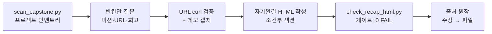

# Workshop Recap 개요

Workshop Recap은 완성된 워크숍 캡스톤을 **하나의 자기완결 HTML 페이지**로 정리하는 플러그인입니다.
프로젝트의 상세 개요, 데모 캡처, 그리고 **실제로 사용한 에이전트 기능의 인벤토리**를 한 장에 담습니다.

핵심 원칙은 하나입니다 — **페이지는 프로젝트가 이미 생성한 콘텐츠에서 작성됩니다.** 기억이나 추측이
아니라 `CLAUDE.md`/`AGENTS.md`, 서브에이전트 정의, 훅 배선, 작성한 스킬, MCP 설정, 설계 스펙,
CI 워크플로, IaC 파일이 사실의 출처입니다.

:::warning 근거 없는 주장은 페이지에 올라가지 않습니다
모든 항목은 **실제 파일 경로**, **검증된 URL**, 또는 **참가자 본인의 서술** 중 하나를 출처로 가집니다.
출처가 없는 기능은 행(row)이 만들어지지 않고, 실제 숫자가 없는 지표는 타일이 생성되지 않습니다.

또한 스캐너에서 발견되지 않은 신호는 "사용하지 않음"이 아니라 **"근거 없음"**으로 취급합니다 —
페이지가 "훅을 사용하지 않았습니다" 같은 부정 주장을 만들어내지 않습니다.
:::

## 주요 기능

| 기능 | 설명 |
|------|------|
| Evidence-first 스캔 | 프로젝트가 생성한 콘텐츠를 인벤토리로 수집, 항목마다 실제 경로 부착 |
| Capability 인벤토리 | 서브에이전트·훅·커맨드·스킬·MCP·CI·Agent SDK 사용 현황을 출처와 함께 정리 |
| 아키타입별 데모 캡처 | 6개 캡스톤 미션 각각에 맞는 캡처 레시피 + 폴백 래더 |
| 자기완결 HTML | CSS 인라인 단일 파일, 빌드 스텝·프레임워크·서버 불필요 |
| 구조 자기검증 | 접근성/반응형/자산 해석/경로 유출을 기계적으로 검사 |

## 대상 워크숍

Claude Code Deep Dive 워크숍은 6개 챕터 랩을 마친 뒤 **6개 캡스톤 미션 중 하나**를 선택해
공개 URL 서비스를 배포합니다. 미션은 난이도가 아니라 정체성이 다릅니다.

| 미션 | 산출물 |
|------|--------|
| A | 운영 모니터링 대시보드 (S3/CloudFront/Lambda/DynamoDB) |
| B | 자가 치유 자율 운영 센터 (카오스 주입) |
| C | AI 카페 자연어 주문 시스템 |
| D | RAG 기반 사내 사서 (임베딩 + 벡터 검색) |
| E | 브라우저 플랫포머 게임 ("Clawd Jump") |
| F | 제너레이티브 아트 갤러리 (벡터 필드 / 반응-확산) |

이 플러그인은 **여섯 가지 모두**에 대응해야 하므로, hero·개요·footer를 제외한 모든 섹션은
조건부입니다 — 근거가 있으면 포함하고, 없으면 생략합니다. 플레이스홀더로 채우지 않습니다.

## 워크플로우

## 페이지 섹션 구성

| 섹션 | 출처 | 필수 여부 |
|------|------|-----------|
| `hero` | 프로젝트명 · 미션 · 한 줄 소개 · 라이브 URL | 필수 |
| `overview` | 지시 파일 / README 요약 (인용) | 필수 |
| `demo` | 캡처 (아키타입별) | 캡처가 있을 때 |
| `architecture` | IaC + 지시 파일 | 아키텍처가 실재할 때 |
| `capabilities` | 스캔 결과 — **각 행이 출처 파일을 명시** | 발견된 기능이 있을 때 |
| `process` | 스캔이 찾은 스펙/플랜 | 존재할 때 |
| `stats` | git 카운트, 기능 카운트 | 실제 숫자가 있는 타일만 |
| `reflection` | 참가자 본인의 서술 | 제공했을 때 |
| `footer` | 생성일, 저장소 | 필수 |

`capabilities`는 제품 브로셔에는 대응물이 없는 섹션이며, 이 워크숍의 실질적 학습 성과에
해당합니다 — 부록이 아니라 페이지의 1급 구성 요소로 다룹니다.

## 구성 요소

| 파일 | 역할 |
|------|------|
| `scripts/scan_capstone.py` | 프로젝트 인벤토리 → JSON (`--selftest` 내장) |
| `scripts/check_recap_html.py` | 구조/접근성 게이트 (`--selftest` 내장) |
| `references/design-system.md` | 토큰, 타이포그래피, 반응형 티어, 접근성, CSS 함정 |
| `references/capture-guide.md` | 미션별 캡처 레시피, 폴백 래더, 스크린샷 위생 |

## 다음 단계

- [설치](./installation.md) — 플러그인 추가 및 검증
- [capstone-recap 스킬](./skills/capstone-recap.md) — 6단계 워크플로 상세
- [capstone-recap-agent](./agents/capstone-recap-agent.md) — 에이전트 결정 트리
