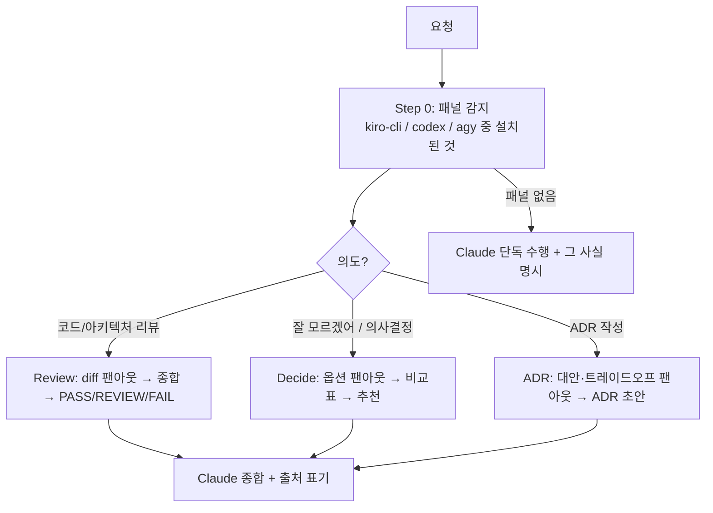

# co-agent

Chairs a panel of **external AI agents** (Kiro CLI, Codex, and Agy) to get a second
opinion, then **synthesizes the final answer as Claude**. The external AIs advise;
Claude decides and writes the artifact. Uses whichever AI CLIs are installed —
degrades gracefully, never hard-fails on a missing one.

> CLI commands, detection, fan-out, fallbacks: `references/ai-cli-adapters.md`.

---

## Core Capabilities

1. **Multi-AI Review** — fan a code/architecture-review prompt out to the available
   AI CLIs, collect each opinion, synthesize consensus vs. dissent + AWS Well-Architected.
2. **Decision Support** — when the user is unsure ("잘 모르겠어"), put the decision +
   options to the panel, build a comparison table, give a synthesized recommendation.
3. **ADR Co-authoring** — gather alternatives/trade-offs/risks from the panel, draft a
   Nygard-format ADR, auto-number it against `docs/decisions/ADR-*.md`, and save it.

Claude is always the chair: attribute points to each AI, surface disagreement, own the verdict.

---

## Mode Routing



Detailed per-mode steps live in `skills/co-agent/SKILL.md`.

---

## Panel detection (always Step 0)

```bash
PANEL=""
# Binary presence only — kiro-cli works headless via interactive login OR
# $KIRO_API_KEY. Unauthenticated CLIs just error at call time → skipped.
# NOTE: the peer label `kiro-cli` is also the binary name — invoke `kiro-cli` directly.
command -v kiro-cli >/dev/null 2>&1 && PANEL="$PANEL kiro-cli"
command -v codex    >/dev/null 2>&1 && PANEL="$PANEL codex"
command -v agy      >/dev/null 2>&1 && PANEL="$PANEL agy"
echo "Panel: ${PANEL:-none (Claude solo)}"
```

Run panel members **in parallel** (`&` + `wait`) capturing each to a file; an empty
or errored output means that AI skipped this run — note it and continue.

---

## Chair principle (non-negotiable)

- External AIs **advise**; **Claude decides and writes the final artifact**.
- **Attribute** notable points ("Agy flagged …"); **surface disagreement** rather than hide it.
- Missing/errored CLI → skip, note, continue. Never block on one AI.
- Keep every AI's prompt **identical** so answers are comparable.

---

## Integration with other agents

이 마켓플레이스는 현재 `co-agent`·`kiro`·`kiro-power-converter`만 제공한다.
PR 리뷰 피드백 반영은 사용자가 직접(또는 `kiro:delegate`로) 하고, ADR 번호 부여/저장은
co-agent가 자체적으로 수행한다(위 "ADR Co-authoring" 참고) — 별도 플러그인 연계는 없다.

---

## Reference Files

- `references/ai-cli-adapters.md` — Kiro/Claude/Codex/Agy CLI commands, detection, fan-out, fallbacks, ADR hand-off
- `references/architecture-review-framework.md` — review rubric, severity, PASS/REVIEW/FAIL
- `references/aws-well-architected.md` — 6-pillar checklist for review mode
